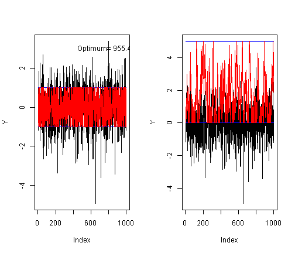

Using convex continuous piecewise linear function for the optimization of storage 
========================================================

First let us load the package 

```r
library(ConConPiWiFun)
```

```
## Warning: package 'Rcpp' was built under R version 2.15.3
```


Now we create the cost functions $C_i$ $i=1,\dots,n$. These are 

```r
CCPWLfuncList=new(cplfunctionvec) 
n=1000; Y=rnorm(n); 
S1=array(-1,n); S2=array(1,n); ## increasing slopes -1, 1 for all C_i i=1,..,n
B0=array(-Inf,n); B1=rnorm(n); ## increasing breakpoints -Inf, N(0,1) for all C_i i=1,..,n
CCPWLfuncList$SerialPush_2Breaks_Functions(S1,S2,B0,B1);
```

Then, we define the constraints on storage (capacity and power constraints)

```r
Pmoins = array(-1, n)
Pplus = array(1, n)
Cmoins = array(0, n)
Cplus = array(5, n)
```


and perform the optimization: 

```r
res = CCPWLfuncList$OptimMargInt(Pmoins, Pplus, Cmoins, Cplus)
```


 


